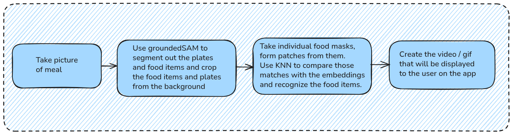
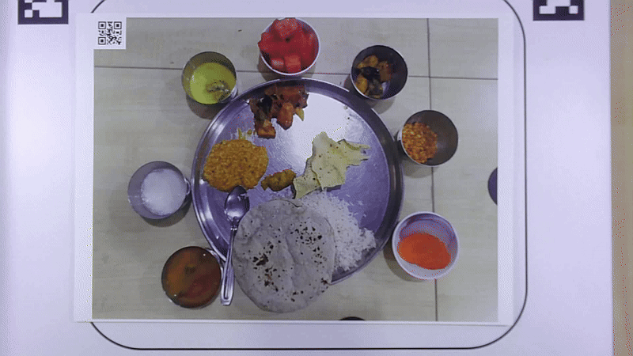

# Know-Your-Meal

### Goal

The goal of this project is that given a food plate (typically an Indian thali), the application should be able to detect the items in the food plate, along with their nutritional values.

### Progress so far

This is the current architecture of the core logic.

The following is a brief description of the pipeline of the project so far.

1. The end-user takes an image of their meal. They can choose to -  
   (a) Just contribute to the database.  
   (b) Know the food items in the meal.  
   (c) Get info about the calorific content of the food items in their meal.
2. The image is taken and passed through [grounding DINO](https://github.com/IDEA-Research/GroundingDINO) (base model, version 0.1.0) with the prompt `"food. plate. cup. bowl. cultery."`. The grounding DINO returns certain bounding boxes which are then sent to [SAM 2](https://github.com/facebookresearch/sam2) - which segments them.
3. The segmentation masks are filtered so as to separate the food masks from the non-food masks. The union of all the generated masks (food and non-food) is used to form the _cropped image_.
4. The food masks are then classified using the [PE-Core](https://huggingface.co/facebook/PE-Core-L14-336) classifer, which classifies the food masks into the different classes (currently it does using KNN with a similarity threshold of 0.6).
5. The classified masks are then processed to create various UIs, that are shown to the end user. The current UI takes the food masks in the _cropped image_, zooms them in, and uses the zoomed in frames to create a video which is shown to the end-user. The following is an example of an output video that is generated by the current pipeline.

<!-- 

<video width="512" height="290" controls>
  <source src="media/ui6_for_readme.mp4" type="video/mp4">
</video>

 -->

