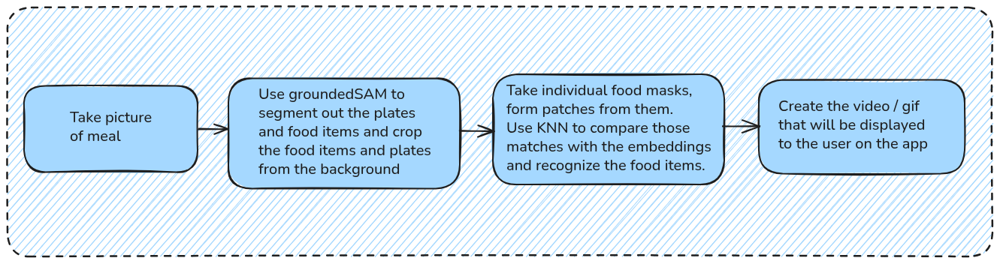

# Know-Your-Meal

### Goal

The goal of this project is that given a food plate (typically an Indian thali), the application should be able to detect the items in the food plate, along with their nutritional values.

As it stands right now, the weight estimation of the food items (hence, the calorie estimation) is still a work in progress. However what we have is the

This is the current architecture of the core logic.

